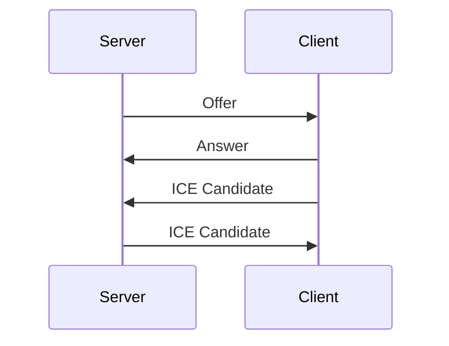

# WebRTC client and server demo

## General

This Project is a simple WebRTC client and server demo. 
The server is written in Go with the Pion WebRTC library.
There are two clients, one written in Go and one in JavaScript.

## Server

The following diagram shows the WebRTC communication between the clients and the server.



## Client (Go)

The Go client is a simple command line application that can be used to establish a WebRTC connection with the server.
It is used to test the connection to the server and inspect the network traffic.

## Client (JavaScript)

The JavaScript client is a simple web application that can be used to establish a WebRTC connection with the server and
display the video.

## Usage

### Server

To start the server, run the following command:

```bash
export PIPELINES=2
export PIPELINE_0="v4l2src device=/dev/video10 ! videoconvert ! vp8enc target-bitrate=1500000 keyframe-max-dist=240 deadline=1 ! appsink name=sink"
export PIPELINE_1="v4l2src device=/dev/video11 ! videoconvert ! vp8enc target-bitrate=1500000 keyframe-max-dist=240 deadline=1 ! appsink name=sink"
export AUDIO_PIPELINE="alsasrc device=hw:4,0 ! audiorate ! audioconvert ! opusenc ! appsink emit-signals=true name=sink"
go run main.go
```

The server will start listening on port 8080. 

### Client (Go)

To start the Go client, run the following command:

```bash
export WEBRTC_SERVER_LOCATION="ws://localhost:8080/ws"
go run main.go 
```

or with a command line argument:

```bash
go build .
./pion-webrtc ws://localhost:8080/ws
```

### Client (JavaScript)

Point your browser to `http://localhost:8080/` to start the JavaScript client.
